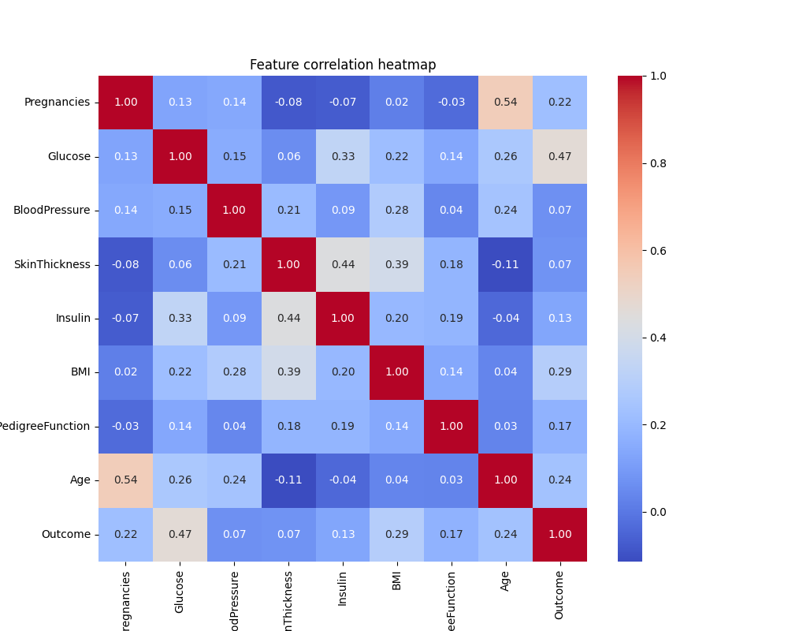
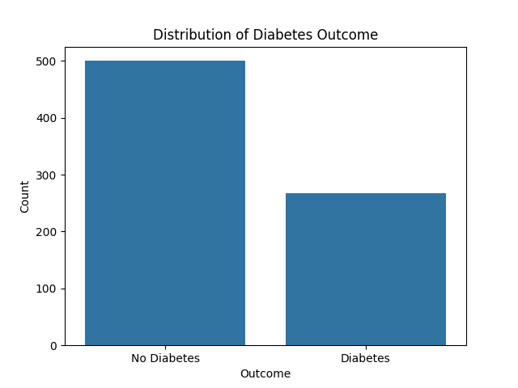
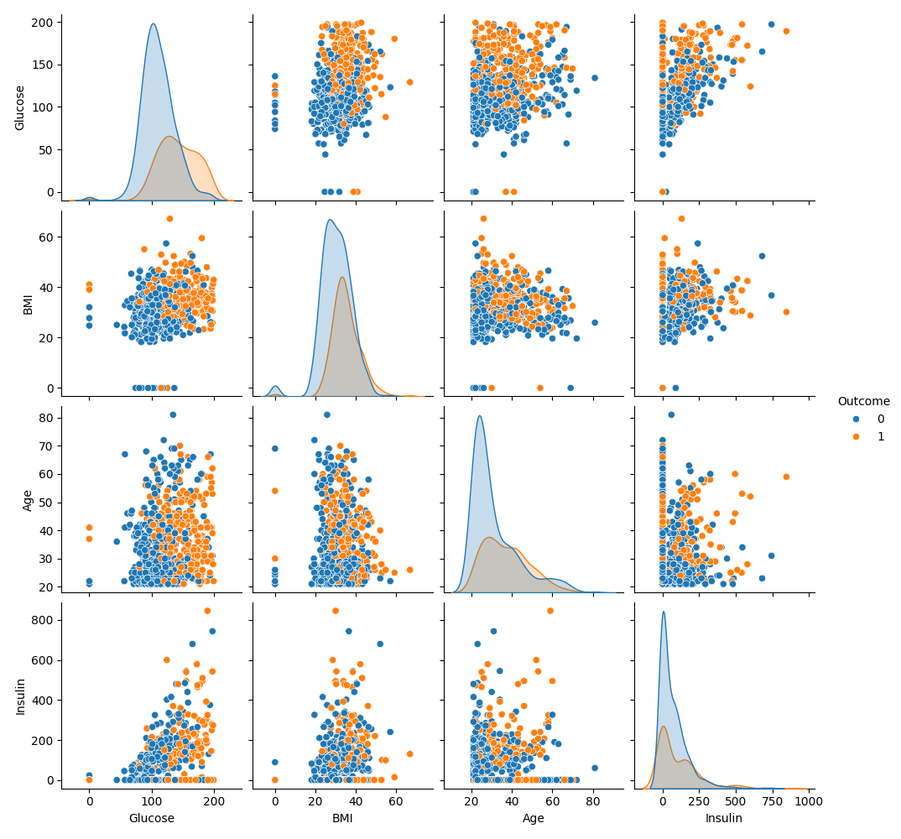
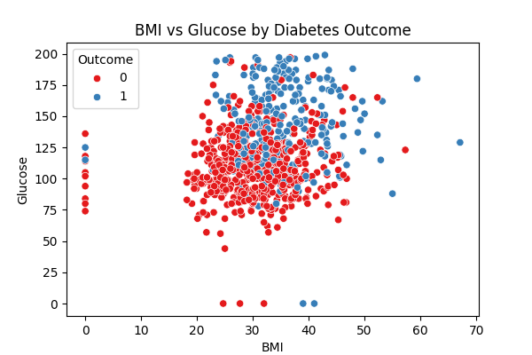
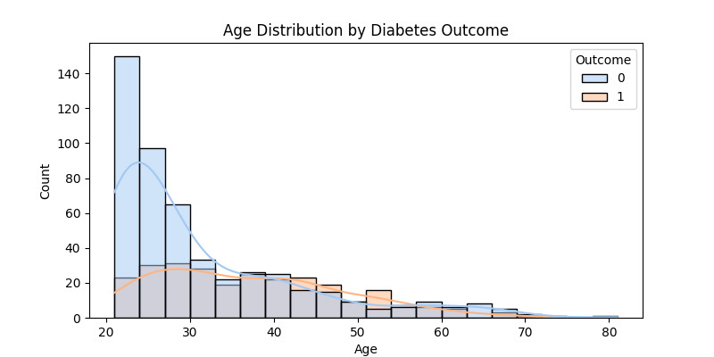

# Diabetes Prediction System

A machine learning web app that predicts whether a person has diabetes or not, based on medical inputs. This project uses a **Support Vector Machine (SVM)** classifier for prediction and is deployed using **Streamlit**.

 **Live Demo**: [Try the App](https://wanyua-diabete-prediction-system-v1.streamlit.app/#enter-the-following-health-metrics-to-predict-diabetes-risk)

---

##  Overview

This project demonstrates how machine learning can assist in early detection of diabetes. Using a clean and simple web interface, users can input relevant health metrics and receive a prediction in real time.

---

##  Technologies Used

- **Python**   
- **Support Vector Machine (SVM)** - for binary classification  
- **Pandas, NumPy, Scikit-learn** - for data preprocessing and modeling  
- **Streamlit** - for web app deployment  

---

##  Dataset

The model is trained on the **Pima Indians Diabetes Dataset**, which includes health-related variables such as:
- Number of pregnancies
- Glucose level
- Blood pressure
- Skin thickness
- Insulin level
- BMI
- Diabetes pedigree function
- Age


---

##  Visualizations

Here are some visual insights from the dataset:

###  1. Correlation Heatmap
Shows how features relate to each other.


---

###  2. Diabetes Class Distribution
Distribution of diabetic (1) vs non-diabetic (0) individuals.


---

###  3. Pairplot of Features
Visualizes relationships between variables, colored by diabetes outcome.


---

###  4. Scatterplot of BMI vs Outcome
Comparing BMI vs Outcome


---
### 5. Age distribution
Age distribution by Diabetes Outcome


##  How It Works

1. Load and preprocess the dataset  
2. Train a Support Vector Machine (SVM) classifier  
3. Evaluate the model using accuracy metrics  
4. Build an interactive web interface using Streamlit  
5. Deploy the app for real-time predictions

---

##  Setup Instructions

1. Clone the repo
   ```bash
   git clone https://github.com/your-username/Diabetes-Prediction-Project.git
   cd Diabetes-Prediction-Project


---

2. Create and activate a virtual environment
```
python -m venv venv
source venv/bin/activate  # or venv\Scripts\activate on Windows
```
3.Install dependencies
```
pip install -r requirements.txt
```
4.Run the Streamlit app
```
streamlit run diabetes_app.py
```
